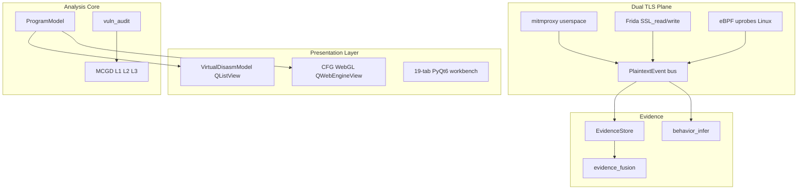

# RevENG Target Architecture

Annotated map of the next-generation RE workbench research vs current RevENG status.

**Legend:** EXISTS | PARTIAL | PLANNED (in roadmap) | DEFERRED

---

## Layer overview



---

## Component status matrix

| Component | Status | Module / notes |
|-----------|--------|----------------|
| PyQt6 19-tab workbench | **EXISTS** | `src/gui/main_window.py` |
| mitmproxy HTTPS capture | **EXISTS** | `src/core/traffic_capture.py` |
| Frida TLS plaintext hooks | **EXISTS** | `src/core/runtime_crypto.py` |
| PlaintextEvent unified schema | **PLANNED → EXISTS** | `src/core/evidence_store.py` |
| PlaintextBus + adapters | **PLANNED → EXISTS** | `src/core/plaintext_bus.py`, `src/core/adapters/` |
| eBPF SSL uprobes (Linux) | **PLANNED** | `src/core/ebpf_capture/` — root + BCC gated |
| OkHttp / TrustKit unpin scripts | **PLANNED → EXISTS** | `assets/frida/` |
| phantom-frida anti-detect | **DEFERRED** | After basic unpin pack |
| ProgramModel (blocks, CFG) | **PARTIAL → EXISTS** | `src/core/program_model.py` — canonical spine |
| Virtual O(1) disassembly | **PLANNED → EXISTS** | `src/gui/models/disasm_model.py` |
| WebGL CFG (Sigma/canvas) | **PLANNED → EXISTS** | `src/gui/cfg_web_viewer.py` |
| matplotlib CFG fallback | **EXISTS** | `src/gui/cfg_viewer.py` — small graphs |
| Single-pass Ollama decompile | **EXISTS** | `src/core/ai_decompiler.py` |
| MCGD L1 Tree-sitter | **PLANNED → EXISTS** | `src/core/mcgd/parser_agent.py` |
| MCGD L2 GCC/Clang | **PLANNED → EXISTS** | `src/core/mcgd/compiler_agent.py` |
| MCGD L3 differential sandbox | **PLANNED → EXISTS** | `src/core/mcgd/execution_agent.py` |
| R(C_d) reward scoring | **PLANNED → EXISTS** | `src/core/mcgd/rewards.py` |
| Agent Studio / CAT7 | **DEFERRED** | Python orchestrator only for now |
| Unicorn stack strings | **PLANNED → EXISTS** | `src/core/emulator/stack_extractor.py` |
| PyGhidra BoringSSL offsets | **PLANNED → EXISTS** | `src/core/pyghidra_analyzer.py` |
| angr / flare-emu / Qiling | **STUB / DEFERRED** | `advanced_unpacking.py` |
| Plugin hook execution | **PLANNED → EXISTS** | `plugin_manager.execute_hook()` wired |
| MCP analysis server | **PLANNED → EXISTS** | `src/api/mcp_server.py` |
| Git collaboration UI | **DEFERRED** | `sync_manager.py` stub |
| SARIF export | **DEFERRED** | Phase E |
| CRC RevEng / dfmt / hardware | **DEFERRED** | Out of core scope |
| Skill Marketplace | **DEFERRED** | Signed plugins first |

---

## Dual-plane network model

| Plane | When to use | Requirement |
|-------|-------------|-------------|
| **Userspace proxy** (mitmproxy) | Electron, Node, Python, CLI launched through interceptor | `mitmdump`, mitm CA |
| **Userspace hooks** (Frida) | Certificate-pinned native/mobile apps | `frida`, authorized target |
| **Kernel plane** (eBPF) | Pinned OpenSSL/BoringSSL on Linux without modifying binary | Linux, root, `bcc` |

All planes emit **`PlaintextEvent`** → `PlaintextBus` → Network Capture UI + EvidenceStore.

---

## MCGD validation pipeline

```
Ghidra/RetDec C → L1 syntax (tree-sitter) → L2 compile (gcc) → L3 exec diff → Verified badge
                      ↑ repair loop (max 5 iter, Policy LLM)
```

UI must **not** show "Verified re-executable" until L3 pass rate meets threshold on benchmarked functions.

---

## Phased delivery (months)

| Phase | Focus | Exit criteria |
|-------|-------|---------------|
| A | PlaintextEvent bus, Frida↔Network, eBPF spike | Three planes, same event shape |
| B | Virtual UI, WebGL CFG, plugin hooks | 10M-line scroll, 5k-node CFG |
| C | MCGD L1–L3 + ExeBench harness | Honest comp/exec metrics in CI |
| D | Unicorn strings, PyGhidra, MCP, eBPF prod | Stack annotations, offset injection |
| E | Git sync, SARIF, signed plugins | Collaboration + export |

See [ROADMAP.md](../ROADMAP.md) and [REVENG_COMPLETE_GUIDE.md](REVENG_COMPLETE_GUIDE.md) for merged timelines.
