# Engineering Phase 001 · Repository Foundation & Engineering Infrastructure

**Status:** Normative  
**Authority:** Repository engineering only  
**Runtime authority:** Research 001–030 and Implementation Specifications 001–014  
**Evolution rule:** Additive only  

---

## 0. Purpose and Scope

### 0.1 Purpose

This document defines the engineering foundation of the RevENG monorepo. Every later Engineering Phase builds upon the layout, ownership rules, build system, dependency graph, standards, workflows, and validation procedures specified here.

This document is implementation-ready for repository engineering. It does not implement platform functionality.

### 0.2 Owns

| Concern | Owner section |
|---|---|
| Repository architecture | §1 |
| Monorepo layout | §2 |
| Package boundaries | §5 |
| Build system | §4 |
| Dependency management | §8 |
| Language strategy | §3 |
| Coding standards | §10 |
| Module naming | §5, §10 |
| Project structure | §2 |
| Configuration hierarchy | §7 |
| Common libraries | §6 |
| Shared utilities | §6 |
| Code generation strategy | §9 |
| CI/CD pipeline | §17, §18 |
| Versioning | §16 |
| Release workflow | §16, §18 |
| Branch strategy | §16 |
| Development workflow | §15 |
| Testing framework | §13 |
| Test organization | §13 |
| Documentation layout | §14 |
| Developer onboarding | §15, §20, §21 |
| Local development environment | §20 |
| Container development environment | §19 |
| Build reproducibility | §4 |
| Repository validation | §22 |
| Repository bootstrap | §21 |
| Engineering APIs | §24 |
| Engineering workers | §25 |
| Engineering events | §26 |
| Extension points | §27 |
| Future compatibility | §28 |
| Migration from current tree | §23 |

### 0.3 Explicitly Does Not Own

The following belong exclusively to later Engineering Phases that implement Implementation Specifications 001–014:

- Runtime
- Scheduler
- Storage
- Reasoning
- Graph
- Investigation
- Reporting
- Public APIs
- Plugins
- Deployment
- Security
- Observability
- Platform validation

No runtime algorithm, storage schema, scheduler policy, API route, reasoning rule, investigation workflow, reporting format, plugin execution model, deployment topology, security control, observability pipeline, or platform validation suite is defined here.

### 0.4 Authority Hierarchy

1. Research 001–030 — architectural truth for platform behavior  
2. Implementation Specifications 001–014 — buildable contracts for platform modules  
3. This document — sole authority for repository engineering  
4. Later Engineering Phases — implement platform packages inside the boundaries defined here  

On conflict between this document and Research/Implementation Specifications regarding runtime behavior, Research and Implementation Specifications win. On conflict regarding repository layout, build, or engineering workflow, this document wins.

### 0.5 Normative Language

- **MUST** — mandatory requirement  
- **MUST NOT** — prohibited  
- **SHALL** — equivalent to MUST for procedural obligations  
- **MAY** — permitted within stated constraints  

---

## 1. Engineering Architecture

### 1.1 Overall Repository Philosophy

RevENG is a single monorepo. All platform packages, applications, shared engineering libraries, IDL, tools, tests, and documentation live in one repository under one lockfile and one CI system.

The monorepo exists to enforce:

- one ownership map  
- one dependency direction  
- one build graph  
- one version train  
- one validation gate  

Platform capability is added by later Engineering Phases as packages under `packages/`. This phase reserves those package names and import rules; it does not populate their runtime contents.

### 1.2 Ownership Rules

1. Every directory under `apps/`, `packages/`, `libs/`, `tools/`, `proto/`, `docs/`, `tests/engineering/`, `docker/`, and `.github/workflows/` has exactly one owner concern.  
2. No two packages MAY own the same runtime capability named in Implementation Specifications 001–014.  
3. Shared code that is not business logic MUST live in `libs/`.  
4. Runnable entrypoints MUST live in `apps/`.  
5. Engineering CLIs MUST live in `tools/`. Thin shell wrappers MAY live in `scripts/` and MUST call `tools/`.  
6. IDL source of truth MUST live in `proto/`. Generated stubs MUST NOT be hand-edited.  
7. Existing desktop application code currently under `src/` is owned by `apps/reveng-desktop` after migration (§23). Until migration completes, `src/` is the transitional location of that same ownership.

### 1.3 Dependency Direction

```text
libs  ←  packages  ←  apps  ←  tools
         ↑
       proto (codegen into libs / package stubs)
```

Rules:

1. `libs/*` MUST NOT import `packages/*`, `apps/*`, or `tools/*`.  
2. `packages/*` MAY import `libs/*` and generated stubs.  
3. `packages/*` MUST NOT import sibling `packages/*` unless an Implementation Specification later names an explicit allowed edge; default is no sibling imports.  
4. `apps/*` MAY import `packages/*` and `libs/*`.  
5. `apps/*` MUST NOT be imported by `packages/*` or `libs/*`.  
6. `tools/*` MAY import `libs/*` and MAY read package metadata; tools MUST NOT import application UI modules.  
7. Domain producer modules MUST share only through `libs/*` contracts and IDL, never by direct sibling import.

### 1.4 Engineering Principles

1. **Implementation-ready infrastructure** — every procedure in this document is executable without inventing structure.  
2. **Single ownership** — every concern has exactly one owner.  
3. **Additive evolution** — new packages, jobs, and proto modules are added; existing ownership is not reassigned without a later Engineering Phase that explicitly migrates it.  
4. **No conflicting mechanisms** — one build orchestrator, one lockfile, one formatter, one primary linter, one typechecker policy, one test runner for Python.  
5. **Runtime neutrality** — engineering decisions exist solely to support later implementation phases.  
6. **Reproducibility** — identical inputs produce identical workspace installs and generated artifacts.  
7. **Deterministic validation** — `repo_validate` either passes or fails with a named rule; no advisory-only ownership checks for layout rules.

---

## 2. Repository Layout

### 2.1 Complete Monorepo Tree

```text
/
├── apps/
│   ├── reveng-desktop/          # PyQt6 desktop application (migrated from src/)
│   ├── reveng-api/              # Public API process entrypoint (Impl Spec 010; reserved; no runtime code in this phase)
│   └── reveng-worker/           # Worker process entrypoint (orchestrator workers; reserved; no runtime code in this phase)
├── packages/
│   ├── core-substrate/          # Impl Spec 001
│   ├── domain-producers/        # Impl Spec 002
│   ├── pass-engine/             # Impl Spec 003
│   ├── storage-evidence/        # Impl Spec 004
│   ├── reasoning/               # Impl Spec 005
│   ├── knowledge-graph/         # Impl Spec 006
│   ├── investigation/           # Impl Spec 007
│   ├── reporting/               # Impl Spec 008
│   ├── plugin-sdk/              # Impl Spec 009
│   ├── public-api/              # Impl Spec 010
│   ├── deployment/              # Impl Spec 011
│   ├── observability/           # Impl Spec 012
│   ├── security/                # Impl Spec 013
│   └── platform-validation/     # Impl Spec 014
├── libs/
│   ├── reveng-types/            # Shared typed envelopes, IDs, enums (engineering contracts)
│   ├── reveng-errors/           # Error taxonomy and Result types
│   ├── reveng-logging/          # Structured logging facade for tools and packages
│   ├── reveng-config/           # Engineering configuration loading hierarchy
│   ├── reveng-testing/          # Shared pytest fixtures and golden helpers
│   └── reveng-codegen/          # Codegen orchestration helpers and output path contracts
├── proto/                       # IDL source of truth
├── tools/
│   ├── bootstrap/               # Workspace bootstrap CLI
│   ├── repo_validate/           # Repository validation CLI
│   ├── codegen/                 # Proto/schema codegen CLI
│   ├── workspace_build/         # Build orchestration CLI
│   └── release_cut/             # Release tagging and artifact CLI
├── scripts/                     # Thin wrappers invoking tools/
├── docs/
│   ├── research/                # Research 001–030
│   ├── implementation/          # Implementation Specifications 001–014
│   └── engineering/             # Engineering Phases (this document = 001)
├── tests/
│   └── engineering/             # Repo-level engineering tests
├── docker/
│   ├── dev.Dockerfile           # Developer image
│   └── ci.Dockerfile            # CI image
├── .github/
│   └── workflows/               # CI and CD workflows
├── .devcontainer/               # Devcontainer definition
├── .python-version              # Pin: 3.12
├── pyproject.toml               # uv workspace root
├── uv.lock                      # Single lockfile
├── README.md
└── LICENSE
```

### 2.2 Package Ownership

| Path | Owner | Implementation Specification | Engineering Phase that populates runtime |
|---|---|---|---|
| `apps/reveng-desktop` | Desktop application entrypoint | — (legacy product surface) | Migration §23; later UI phases |
| `apps/reveng-api` | API process entrypoint | 010 | Engineering phase for public APIs |
| `apps/reveng-worker` | Worker process entrypoint | 001/003 orchestration surface | Engineering phase for runtime/orchestrator |
| `packages/core-substrate` | Core substrate | 001 | Engineering Phase 002+ |
| `packages/domain-producers` | Domain producers | 002 | Later domain engineering phases |
| `packages/pass-engine` | Pass engine | 003 | Later engineering phase |
| `packages/storage-evidence` | Storage and evidence | 004 | Later engineering phase |
| `packages/reasoning` | Reasoning | 005 | Later engineering phase |
| `packages/knowledge-graph` | Knowledge graph | 006 | Later engineering phase |
| `packages/investigation` | Investigation | 007 | Later engineering phase |
| `packages/reporting` | Reporting | 008 | Later engineering phase |
| `packages/plugin-sdk` | Plugin SDK | 009 | Later engineering phase |
| `packages/public-api` | Public API library | 010 | Later engineering phase |
| `packages/deployment` | Deployment | 011 | Later engineering phase |
| `packages/observability` | Observability | 012 | Later engineering phase |
| `packages/security` | Security | 013 | Later engineering phase |
| `packages/platform-validation` | Platform validation | 014 | Later engineering phase |
| `libs/*` | Shared engineering libraries | — | This phase defines; populated with engineering-only code |
| `tools/*` | Engineering CLIs | — | This phase |
| `proto/` | IDL | Cross-cutting contracts | Populated when contracts are introduced by later phases |
| `tests/engineering/` | Repository engineering tests | — | This phase |
| `.github/workflows/` | CI/CD | — | This phase |
| `docker/` | Dev/CI containers | — | This phase |

Empty package directories are ownership reservations. Each reserved package MUST contain a `README.md` stating its Impl Spec owner and a `pyproject.toml` registering it in the workspace once the workspace is bootstrapped. Reserved packages MUST NOT contain runtime algorithms in this phase.

### 2.3 Directory Responsibilities

| Directory | Responsibility |
|---|---|
| `apps/` | Process entrypoints and application wiring only |
| `packages/` | Platform libraries implementing Impl Specs 001–014 |
| `libs/` | Cross-cutting engineering libraries with no domain business logic |
| `proto/` | Interface definition language sources |
| `tools/` | Developer and CI engineering commands |
| `scripts/` | Thin OS wrappers; no business logic |
| `docs/research/` | Frozen research documents |
| `docs/implementation/` | Frozen implementation specifications |
| `docs/engineering/` | Engineering phase documents |
| `tests/engineering/` | Tests that validate repository engineering invariants |
| `docker/` | Images for local and CI engineering environments |
| `.devcontainer/` | Editor-attached container development definition |

### 2.4 Transitional Layout (Pre-Migration)

Until §23 migration completes, the following transitional mapping applies:

| Current path | Target ownership |
|---|---|
| `src/` | `apps/reveng-desktop/` |
| `tests/` (product tests) | `apps/reveng-desktop/tests/` |
| `packaging/` | `apps/reveng-desktop/packaging/` |
| `plugins/` (bundled examples) | `apps/reveng-desktop/plugins/` or later `packages/plugin-sdk` examples |
| `requirements*.txt` | uv workspace dependency groups |
| `setup.py` | retired after workspace cutover |
| `main.py` | `apps/reveng-desktop` entrypoint |

Transitional paths do not create dual ownership. They are temporary locations of the same owners.

---

## 3. Language Strategy

### 3.1 Primary Language

**Python 3.12** is the primary language for all `apps/`, `packages/`, `libs/`, and `tools/` code.

- CI matrix primary: Python 3.12  
- `.python-version` MUST pin `3.12`  
- Python 3.11 MAY remain in CI solely for `apps/reveng-desktop` until migration and dependency wheels are verified on 3.12-only; after that verification, 3.11 is removed from CI  

### 3.2 Secondary Languages

| Language | Permitted location | Purpose |
|---|---|---|
| Protocol Buffers | `proto/**/*.proto` | Cross-process and bus contracts |
| Shell (bash/zsh) | `scripts/`, CI workflow steps, thin wrappers | Invoke `tools/` and system bootstrap |
| C | Only under a package later designated for native probes (e.g. eBPF) | Native probes required by an Impl Spec |
| JavaScript | Static assets under application asset trees | Existing WebGL/Frida helper assets |

### 3.3 Where Each Language Is Permitted

1. Application logic, package logic, libs, and tools MUST be Python 3.12.  
2. New application languages (Rust, Go, TypeScript application packages, Java, Kotlin) MUST NOT be introduced by this phase.  
3. JavaScript MUST NOT be used as an application or service language.  
4. C MUST NOT appear outside a later phase’s explicitly owned native probe package.  
5. Protobuf is the only IDL permitted for cross-language contracts.

### 3.4 Interoperability Rules

1. Cross-package Python imports follow §1.3.  
2. Cross-process contracts MUST be defined in `proto/` and consumed via generated Python stubs.  
3. Hand-written duplicate DTOs that mirror proto messages MUST NOT be introduced; extend proto instead.  
4. Asset JavaScript communicates with Python only through documented application bridges already owned by the desktop app; no new polyglot IPC stack is defined here.

### 3.5 Toolchain Languages Not Adopted

Bazel, Pants, Buck, npm workspaces, Cargo workspaces, and Go modules are not part of this repository’s build system. Introducing any of them requires a later Engineering Phase that revises §4 and §8.

---

## 4. Build System

### 4.1 Build Orchestration

The sole build orchestrator is **uv** with a root workspace declared in `pyproject.toml` via `tool.uv.workspace`.

Responsibilities:

| Tool | Role |
|---|---|
| `uv` | Workspace sync, lock, run, build |
| `hatchling` | Package build backend for each `pyproject.toml` |
| `tools/workspace_build` | Thin orchestration CLI over uv for CI and developers |
| `tools/codegen` | Generates stubs before package builds that depend on them |

Root `setup.py` is retired by migration (§23). No second orchestrator is permitted.

### 4.2 Incremental Builds

1. uv resolves the package dependency graph from workspace members and path dependencies.  
2. CI caches the uv cache directory and virtualenv keyed by `uv.lock` hash and Python version.  
3. Codegen runs only when `proto/` or codegen templates change (path filters in CI).  
4. Package builds run only for packages affected by the change set when CI path filtering is configured; full graph build runs on `main`, `dev`, and release tags.

### 4.3 Reproducible Builds

1. Single `uv.lock` at repository root.  
2. `.python-version` pins the interpreter major.minor.  
3. CI and devcontainer use `docker/ci.Dockerfile` / `docker/dev.Dockerfile` with pinned base image digests.  
4. Codegen is CI-generated with verify-dirty (§9): generated output MUST match what CI would produce.  
5. Build commands MUST NOT depend on ambient global site-packages.

### 4.4 Dependency Graph

```text
reveng-types
reveng-errors      → reveng-types
reveng-logging     → reveng-types, reveng-errors
reveng-config      → reveng-types, reveng-errors
reveng-testing     → reveng-types, reveng-errors
reveng-codegen     → reveng-types, reveng-errors, reveng-logging

packages/*         → libs/* (as needed), generated stubs
apps/*             → packages/* (as needed), libs/*
tools/*            → libs/*
```

`tools/workspace_build` MUST emit the resolved graph for validation and documentation regeneration.

### 4.5 Standard Build Commands

| Command | Effect |
|---|---|
| `uv sync --all-groups` | Install workspace from lockfile |
| `uv run tools.workspace_build` | Build all workspace packages |
| `uv run tools.codegen` | Generate stubs from `proto/` |
| `uv run tools.repo_validate` | Run repository validation |
| `uv build --all` | Produce distribution artifacts for workspace members |

Exact console script entrypoint names are owned by each tool’s `pyproject.toml` and MUST be registered under the `reveng-` prefix (e.g. `reveng-bootstrap`, `reveng-validate`).

---

## 5. Package Architecture

### 5.1 Package Categories

| Category | Location | May contain business logic |
|---|---|---|
| Application | `apps/` | Yes (wiring only; domain logic MUST live in packages) |
| Platform package | `packages/` | Yes (owned by Impl Spec) |
| Engineering library | `libs/` | No |
| Engineering tool | `tools/` | No (tooling only) |

### 5.2 Naming

| Kind | Directory name | Python distribution name | Import package |
|---|---|---|---|
| App | `reveng-<name>/` | `reveng-<name>` | `reveng_<name>` |
| Platform package | `<capability>/` kebab-case | `reveng-<capability>` | `reveng_<capability>` |
| Lib | `reveng-<name>/` | `reveng-<name>` | `reveng_<name>` |
| Tool | `<verb>/` or `reveng_<verb>` project | `reveng-<verb>` | `reveng_<verb>` |

Platform package directory names match §2.1 exactly. Distribution names always use the `reveng-` prefix.

### 5.3 Package Manifest Requirements

Every workspace member MUST provide:

1. `pyproject.toml` with name, version (workspace-aligned), requires-python `>=3.12`, hatchling build  
2. `README.md` stating owner and Impl Spec reference when applicable  
3. `src/<import_package>/` layout for Python packages  
4. No runtime code in reserved packages until the owning Engineering Phase  

### 5.4 Boundary Enforcement

`tools/repo_validate` MUST enforce:

1. Forbidden import edges from §1.3  
2. No imports from `apps/` into `packages/` or `libs/`  
3. No sibling `packages/*` imports unless allowlisted by a later Engineering Phase document  
4. Package name and import package consistency  

### 5.5 Mapping to Implementation Specifications

| Impl Spec | Package |
|---|---|
| 001 | `packages/core-substrate` |
| 002 | `packages/domain-producers` |
| 003 | `packages/pass-engine` |
| 004 | `packages/storage-evidence` |
| 005 | `packages/reasoning` |
| 006 | `packages/knowledge-graph` |
| 007 | `packages/investigation` |
| 008 | `packages/reporting` |
| 009 | `packages/plugin-sdk` |
| 010 | `packages/public-api` + `apps/reveng-api` |
| 011 | `packages/deployment` |
| 012 | `packages/observability` |
| 013 | `packages/security` |
| 014 | `packages/platform-validation` |

---

## 6. Shared Libraries

### 6.1 Library Set

| Library | Owns | MUST NOT own |
|---|---|---|
| `reveng-types` | Shared IDs, enums, typed envelopes used across engineering and later packages | Domain algorithms, storage, UI |
| `reveng-errors` | Error codes, Result/Error types for engineering and package boundaries | HTTP status mapping for public API (Impl Spec 010) |
| `reveng-logging` | Structured logging facade and field conventions for tools/packages | Metrics, tracing pipelines (Impl Spec 012) |
| `reveng-config` | Engineering config load order and schema validation for tools | Runtime product configuration for UPDB/workers/plugins |
| `reveng-testing` | Pytest fixtures, temp workspace helpers, golden file helpers | Platform integration test suites |
| `reveng-codegen` | Codegen path contracts, plugin hooks for generators | Hand-written runtime stubs |

### 6.2 Shared Library Architecture Rules

1. Libs are the only place for cross-cutting non-business utilities.  
2. Duplicating lib functionality inside packages is forbidden.  
3. A new shared concern becomes a new `libs/reveng-*` member via §27 extension points.  
4. Libs remain runtime-neutral: they may define types and helpers consumed by later phases, but they MUST NOT implement scheduler, storage, reasoning, or investigation behavior.

### 6.3 Utility Placement Decision

| If the code is… | Place it in… |
|---|---|
| Used by two or more packages and not business logic | `libs/` |
| Specific to one Impl Spec | owning `packages/` member |
| Only needed to run a process | owning `apps/` member |
| Only needed for developers/CI | `tools/` |

---

## 7. Configuration Architecture

### 7.1 Scope

This section owns **engineering and tooling configuration** only. Runtime product configuration (UPDB paths, worker pools, plugin trust, deployment topology) is owned by later Engineering Phases implementing the relevant Implementation Specifications.

### 7.2 Hierarchy (Highest Precedence Last)

1. Repository defaults shipped in `libs/reveng-config`  
2. Package-local engineering settings in that package’s `pyproject.toml` `[tool.reveng]` tables  
3. Environment variables prefixed `REVENG_`  
4. Local override file `.reveng.local.toml` (gitignored)  
5. CLI flags passed to `tools/*`  

### 7.3 Environment Variable Namespace

| Prefix | Owner |
|---|---|
| `REVENG_ENG_*` | Engineering tools (bootstrap, validate, codegen, build) |
| `REVENG_*` reserved for later runtime phases | Not interpreted by Engineering Phase 001 tools except documented passthrough |

Engineering tools MUST only read `REVENG_ENG_*` and standard toolchain variables (`UV_*`, `PYTHON*`).

### 7.4 Configuration Files

| File | Tracked | Purpose |
|---|---|---|
| `pyproject.toml` (root) | Yes | Workspace, tool config (ruff, pytest, uv) |
| `libs/reveng-config` defaults | Yes | Default engineering schemas |
| `.reveng.local.toml` | No | Developer machine overrides |
| `.env` | No | Local secrets/overrides; `.env.example` may document non-secret keys |
| `.python-version` | Yes | Interpreter pin |

### 7.5 Forbidden Configuration Patterns

1. Second competing config loader outside `reveng-config` for engineering tools  
2. Committing machine-local paths in tracked config  
3. Encoding runtime product policy in engineering config  

---

## 8. Dependency Management

### 8.1 Sole Dependency Manager

**uv** is the sole dependency manager. pip-tools, Poetry, Pipenv, and Conda are not used for workspace management.

### 8.2 Lockfile

- One `uv.lock` at repository root  
- All installs in CI and bootstrap MUST use `--frozen` against the lockfile  
- Lockfile updates occur via `uv lock` on intentional dependency changes and MUST be committed in the same change set  

### 8.3 Dependency Groups

Root workspace defines groups:

| Group | Contents |
|---|---|
| default | Runtime deps for packages being developed |
| `dev` | pytest, ruff, pyright, pre-commit, engineering test helpers |
| `packaging` | PyInstaller and desktop packaging deps for `apps/reveng-desktop` |
| `optional` | Heavy optional analysis deps historically in `requirements-optional.txt` |
| `optional-linux` | Linux-only optional deps |

Migration maps existing `requirements*.txt` files into these groups and then removes the fragmented requirements files.

### 8.4 Version Pinning Policy

1. Application and library dependencies are locked in `uv.lock`.  
2. Lower bounds in `pyproject.toml` MUST be intentional and compatible with the lockfile.  
3. Direct URL / VCS dependencies require justification in the PR description and MUST be locked.  
4. Native system packages required for optional features are documented in package READMEs; they are not silently assumed.

### 8.5 Adding a Dependency

1. Add to the owning package’s `pyproject.toml`.  
2. Run `uv lock`.  
3. Run `uv sync --all-groups`.  
4. Run `reveng-validate`.  
5. Commit manifest + lockfile together.

---

## 9. Code Generation

### 9.1 Source of Truth

`proto/` is the sole IDL source of truth for cross-process contracts introduced by later phases.

### 9.2 Generation Mode

**CI-generated + verify-dirty:**

1. Developers and CI run `reveng-codegen`.  
2. Generated Python stubs are written to paths owned by `libs/reveng-codegen` output contracts (and package stub packages as later phases require).  
3. CI fails if the working tree is dirty after codegen (drift detection).  
4. Generated files MAY be committed to keep editors and offline workflows consistent; verify-dirty still applies.

### 9.3 Generator Ownership

| Component | Owner |
|---|---|
| Proto files | `proto/` + owning Impl Spec phase that introduces the contract |
| Generator CLI | `tools/codegen` |
| Path contracts and helpers | `libs/reveng-codegen` |
| Generated output | Not hand-edited; owned by codegen |

### 9.4 Rules

1. Hand-editing generated files is forbidden.  
2. New generators attach through `reveng-codegen` extension hooks (§27).  
3. Codegen MUST be deterministic given identical proto inputs and generator versions.  
4. This phase does not invent runtime message schemas; it only defines the engineering mechanism.

---

## 10. Coding Standards

### 10.1 Formatter and Linter

| Tool | Role |
|---|---|
| Ruff format | Sole formatter |
| Ruff lint | Sole primary linter |
| Pyright | Sole typechecker |

Black and isort are not run as separate tools; Ruff covers formatting and import sorting.

### 10.2 Style

1. Python: 4-space indent, UTF-8, LF line endings (`.editorconfig`).  
2. Public functions and classes in `libs/` and `tools/` MUST have type annotations.  
3. Packages gain the same annotation requirement when populated by later phases.  
4. Module names: `snake_case`. Distribution names: `reveng-kebab-case`.  

### 10.3 Import Standards

1. Absolute imports MUST be used within a package.  
2. No star imports.  
3. Import boundaries enforced by Ruff first-party settings and `reveng-validate`.  

### 10.4 File and Module Layout

```text
<member>/
  pyproject.toml
  README.md
  src/
    <import_package>/
      __init__.py
      ...
  tests/                  # present when the member has code
```

### 10.5 Documentation Strings

Engineering libraries and tools MUST use docstrings on public modules and entrypoints. Runtime package docstring standards are defined by the Engineering Phase that populates them, inheriting this baseline.

### 10.6 Pre-Commit

`.pre-commit-config.yaml` runs Ruff format/lint on staged Python files. Bootstrap installs pre-commit hooks. Pre-commit does not replace CI.

---

## 11. Error Handling Standards

### 11.1 Owner

`libs/reveng-errors` owns the engineering error taxonomy and Result types used by tools and shared libraries.

### 11.2 Rules

1. Engineering CLIs MUST return process exit code `0` on success and non-zero on failure.  
2. Structured errors MUST include: stable `code` (string enum), `message`, and optional `context` mapping.  
3. Exceptions that escape a tool main() MUST be converted to a structured error and logged via `reveng-logging`.  
4. Domain/runtime error taxonomies for analysis, storage, and APIs are owned by later phases; they MAY reuse `reveng-errors` primitives but MUST NOT redefine engineering tool error codes.

### 11.3 Engineering Error Code Namespaces

| Prefix | Owner |
|---|---|
| `ENG.BOOTSTRAP.*` | `tools/bootstrap` |
| `ENG.VALIDATE.*` | `tools/repo_validate` |
| `ENG.CODEGEN.*` | `tools/codegen` |
| `ENG.BUILD.*` | `tools/workspace_build` |
| `ENG.RELEASE.*` | `tools/release_cut` |

---

## 12. Logging Standards

### 12.1 Owner

`libs/reveng-logging` owns the structured logging facade for engineering tools and is the baseline for later package logging.

### 12.2 Rules

1. Tools MUST log structured JSON lines to stderr for CI consumption.  
2. Required fields: `timestamp`, `level`, `logger`, `message`, `event` (when emitting §26 events).  
3. Secrets MUST NOT be logged.  
4. Runtime observability (metrics, traces, audit pipelines) is owned by the Engineering Phase implementing Impl Spec 012; this section does not define those pipelines.

### 12.3 Log Levels

| Level | Use |
|---|---|
| DEBUG | Developer diagnosis |
| INFO | Normal progress |
| WARNING | Recoverable anomaly |
| ERROR | Operation failure |
| CRITICAL | Bootstrap/CI cannot continue |

---

## 13. Testing Architecture

### 13.1 Test Runner

Pytest is the sole Python test runner.

### 13.2 Test Organization

| Location | Contents |
|---|---|
| `tests/engineering/` | Layout, bootstrap, import-boundary, lockfile, codegen verify-dirty, config hierarchy |
| `<member>/tests/` | Unit tests for that workspace member once it contains code |
| `apps/reveng-desktop/tests/` | Existing product tests after migration |

### 13.3 Engineering Test Categories

1. **Layout tests** — required directories and ownership README markers exist  
2. **Boundary tests** — forbidden imports fail validation  
3. **Bootstrap tests** — bootstrap is idempotent on a clean workspace fixture  
4. **Lockfile tests** — `uv lock --check` equivalent  
5. **Codegen tests** — deterministic output hash for fixture protos  

### 13.4 Out of Scope

Platform integration tests, investigation E2E suites, deployment smoke tests, security conformance suites, and observability pipeline tests are owned by later Engineering Phases / Impl Spec 014.

### 13.5 Coverage Policy (Engineering Scope)

CI enforces coverage gates on `libs/` and `tools/` once those packages contain code. Reserved empty packages are excluded until populated.

---

## 14. Documentation Architecture

### 14.1 Layout

```text
docs/
├── research/           # Research 001–030
├── implementation/     # Implementation Specifications 001–014
└── engineering/        # Engineering Phase documents
    └── ENGINEERING_PHASE_001_REPOSITORY_FOUNDATION.md  # this document
```

### 14.2 Ownership

| Tree | Authority |
|---|---|
| `docs/research/` | Architecture (frozen) |
| `docs/implementation/` | Buildable module contracts (frozen) |
| `docs/engineering/` | Engineering execution blueprints |

### 14.3 Naming

Engineering documents MUST use:

`ENGINEERING_PHASE_<NNN>_<SHORT_TITLE>.md`

### 14.4 README

Root `README.md` owns developer-facing quickstart and MUST point to:

1. This document for repository engineering  
2. Research/Implementation trees for platform architecture  
3. Bootstrap command for local setup  

### 14.5 No Duplicate Ownership

User guides and product manuals MAY exist under `docs/` with distinct names; they MUST NOT redefine monorepo layout or build rules owned by this document.

---

## 15. Developer Workflow

### 15.1 First-Time Setup

1. Install `uv` and Docker (for container workflow) or local Python 3.12.  
2. Clone the repository.  
3. Run `uv run reveng-bootstrap` (or `scripts/bootstrap` wrapper).  
4. Run `uv run reveng-validate`.  
5. Run engineering tests: `uv run pytest tests/engineering`.  

### 15.2 Daily Loop

1. Sync: `uv sync --all-groups`  
2. Create branch per §16  
3. Implement within owned package boundaries  
4. Format/lint: `uv run ruff check --fix` and `uv run ruff format`  
5. Typecheck scoped paths: `uv run pyright`  
6. Test affected packages + `tests/engineering` when touching infra  
7. Validate: `uv run reveng-validate`  
8. Commit and open PR to `dev` or as specified in §16  

### 15.3 Onboarding Checklist

1. Read §0–§2 of this document  
2. Read Implementation Spec index for the package you will touch  
3. Complete bootstrap  
4. Run validation and engineering tests  
5. Confirm editor uses workspace venv  

---

## 16. Git Workflow

### 16.1 Branches

| Branch | Purpose | Protection |
|---|---|---|
| `main` | Release-ready history | Protected; CI green required |
| `dev` | Integration branch | Protected; CI green required |
| `eng/<phase>-<slug>` | Engineering phase work | PR into `dev` |
| `feat/<slug>` | Feature work after packages exist | PR into `dev` |
| `fix/<slug>` | Bug fixes | PR into `dev` (hotfix to `main` only for release fixes) |

### 16.2 Versioning

- **SemVer** for the monorepo release train: `MAJOR.MINOR.PATCH`  
- Tags: `vMAJOR.MINOR.PATCH`  
- Workspace members share the workspace version until a later Engineering Phase introduces independent package versioning (§28)  

### 16.3 Commit Standards

1. Imperative subject line summarizing why  
2. No secrets in commits  
3. Manifest and `uv.lock` change together  

### 16.4 Release Workflow

1. Ensure `dev` is green  
2. Merge `dev` → `main` via PR  
3. Run `reveng-release-cut` to create annotated tag `vX.Y.Z`  
4. Tag push triggers CD (§18)  
5. GitHub Release publishes engineering artifacts and desktop packaging artifacts owned by `apps/reveng-desktop`  

### 16.5 Code Review

1. PRs MUST pass CI  
2. Ownership changes to §2 package map require documentation update in this phase document or a superseding Engineering Phase  
3. Runtime behavior changes require Impl Spec alignment and are out of scope for pure engineering PRs  

---

## 17. CI Pipeline

### 17.1 Owner

`.github/workflows/ci.yml` is the sole continuous integration workflow for engineering gates.

### 17.2 Triggers

- Pull requests to `main` and `dev`  
- Pushes to `main` and `dev`  

### 17.3 Job Sequence

1. **Checkout**  
2. **Setup** — Python 3.12, uv, cache by `uv.lock`  
3. **Sync** — `uv sync --all-groups --frozen`  
4. **Codegen** — `reveng-codegen` + verify-dirty  
5. **Lint** — Ruff check  
6. **Format check** — Ruff format --check  
7. **Typecheck** — Pyright on `libs/` and `tools/` (expand per later phases)  
8. **Validate** — `reveng-validate`  
9. **Test** — `pytest tests/engineering` and member tests that exist  
10. **Build dry-run** — `reveng-workspace-build` / `uv build` for workspace members with code  

### 17.4 Matrix

- OS: Ubuntu, macOS  
- Python: 3.12 (primary); 3.11 only while desktop migration compatibility requires it  

### 17.5 Existing Workflow Evolution

Current workflows under `.github/workflows/` evolve to this sequence when bootstrap is executed. Until bootstrap, transitional CI continues to test the legacy tree without contradicting this target.

---

## 18. CD Pipeline

### 18.1 Owner

`.github/workflows/release.yml` owns continuous delivery for **engineering artifacts and desktop packaging**.

### 18.2 Scope

CD in this phase publishes:

1. Engineering tool wheels / locked workspace build outputs needed for developers  
2. Dev/CI container images from `docker/`  
3. Desktop application artifacts via the existing PyInstaller path owned by `apps/reveng-desktop`  

### 18.3 Explicit Non-Scope

Production platform deployment, Kubernetes rollouts, cluster secrets, and service mesh configuration are owned by the Engineering Phase implementing Impl Spec 011. This CD pipeline MUST NOT deploy the distributed platform.

### 18.4 Trigger

- Push of tag `v*`  
- Manual workflow dispatch for dry-run builds  

### 18.5 Sequence

1. Verify tag matches SemVer  
2. Run full CI-equivalent job set  
3. Build artifacts  
4. Publish GitHub Release assets  
5. Publish container images to the repository’s configured container registry for **dev/CI use**  

---

## 19. Containerized Development

### 19.1 Images

| File | Purpose |
|---|---|
| `docker/dev.Dockerfile` | Local development image |
| `docker/ci.Dockerfile` | CI-aligned image |
| `.devcontainer/devcontainer.json` | Editor attachment to dev image |

### 19.2 Contents

Dev/CI images include:

- Python 3.12  
- uv  
- Proto toolchain versions pinned for codegen  
- git, build essentials required for workspace packages  

### 19.3 Rules

1. Container development MAY be used; when used it MUST match CI Python and uv versions.  
2. No production orchestration stack is defined here.  
3. Compose files, if added, are for engineering services only (e.g. local codegen helpers), not platform deployment.

---

## 20. Local Development Environment

### 20.1 Required Tools

| Tool | Purpose |
|---|---|
| Python 3.12 | Primary runtime for engineering |
| uv | Workspace manager |
| git | Version control |
| Docker | Optional container workflow |

### 20.2 Virtual Environment

Bootstrap creates a repository-local virtualenv managed by uv. Developers MUST use that environment for all `uv run` commands.

### 20.3 Editor Expectations

1. Workspace root is the repository root  
2. Python interpreter is the uv environment  
3. Ruff and Pyright use root `pyproject.toml` configuration  

### 20.4 Local Secrets

Secrets stay in untracked `.env` / `.reveng.local.toml`. `.env.example` documents non-secret engineering keys only.

---

## 21. Repository Bootstrap

### 21.1 Owner

`tools/bootstrap` (`reveng-bootstrap`) owns bootstrap.

### 21.2 Bootstrap Procedure

1. Verify Python 3.12 availability (or let uv fetch it).  
2. Verify `uv` availability.  
3. Create/sync workspace: `uv sync --all-groups`.  
4. Install pre-commit hooks.  
5. Run codegen if `proto/` contains sources.  
6. Run `reveng-validate`.  
7. Emit `BootstrapCompleted` (§26).  

### 21.3 Idempotency

Bootstrap MUST be safe to re-run. Re-running on an already bootstrapped workspace syncs the lockfile and re-validates without destroying local untracked files.

### 21.4 Failure Behavior

On failure, bootstrap exits non-zero with an `ENG.BOOTSTRAP.*` error and does not emit `BootstrapCompleted`.

### 21.5 Wrapper

`scripts/bootstrap` MAY exist as a thin shell wrapper calling `reveng-bootstrap`.

---

## 22. Repository Validation

### 22.1 Owner

`tools/repo_validate` (`reveng-validate`) owns validation.

### 22.2 Validation Rules

| Rule ID | Check |
|---|---|
| `VAL.LAYOUT.001` | Required top-level directories from §2 exist (post-bootstrap target tree) |
| `VAL.LAYOUT.002` | Each `packages/*` reservation has README ownership marker |
| `VAL.DEP.001` | No forbidden import edges (§1.3) |
| `VAL.DEP.002` | `uv.lock` present and in sync (`uv lock --check`) |
| `VAL.PY.001` | `.python-version` is `3.12` |
| `VAL.CODEGEN.001` | Codegen verify-dirty clean when proto present |
| `VAL.TOOL.001` | Required engineering tool entrypoints registered |
| `VAL.DOC.001` | This Engineering Phase 001 document present under `docs/engineering/` |

### 22.3 Output

Validation prints a machine-readable summary and exits `0` only if all enabled rules pass. Failures emit `ValidationFailed` (§26).

### 22.4 Transitional Mode

Before migration completes, layout rules that require `apps/` MAY run in transitional mode that accepts `src/` as `apps/reveng-desktop` equivalent. Transitional mode is removed when §23 completes.

---

## 23. Migration Strategy

### 23.1 Goal

Transform the current single-package Python application tree into the monorepo layout without changing product behavior in the same step as the move.

### 23.2 Deterministic Sequence

1. **Introduce engineering spine** — add `libs/*`, `tools/*`, `docs/engineering/`, `tests/engineering/`, root uv workspace `pyproject.toml`, `.python-version`, docker/devcontainer stubs.  
2. **Reserve packages** — create `packages/*` ownership README + empty package manifests.  
3. **Reserve apps** — create `apps/reveng-api` and `apps/reveng-worker` reservations; create `apps/reveng-desktop` target.  
4. **Move desktop** — move `src/` → `apps/reveng-desktop/src/` (or equivalent package layout), move `main.py` entrypoint, move packaging and product tests.  
5. **Map dependencies** — translate `requirements*.txt` into uv groups; generate `uv.lock`; keep tests green.  
6. **Extract libs** — move only import-safe shared utilities from desktop into `libs/reveng-*`.  
7. **Retire legacy manifests** — remove root `setup.py` and obsolete requirements files after cutover.  
8. **Enable full validation** — disable transitional layout mode.  
9. **Align CI/CD** — update workflows to §17–§18.  

### 23.3 Invariants During Migration

1. Product tests remain green at each step.  
2. No runtime platform packages are implemented “while moving.”  
3. Ownership never duplicates: each path maps to one owner.  
4. Moves MUST be additive relative to ownership; behavioral changes MUST be separate commits from moves.

---

## 24. Engineering APIs

Engineering APIs are tooling interfaces, not product public APIs.

| API | CLI | Responsibility |
|---|---|---|
| Bootstrap | `reveng-bootstrap` | §21 |
| Validate | `reveng-validate` | §22 |
| Codegen | `reveng-codegen` | §9 |
| Workspace build | `reveng-workspace-build` | §4 |
| Release cut | `reveng-release-cut` | §16, §18 |

### 24.1 Interface Rules

1. Each CLI MUST support `--help` and `--json` summary output for CI.  
2. CLIs MUST use `reveng-config`, `reveng-logging`, and `reveng-errors`.  
3. CLIs MUST NOT start platform runtime services.

---

## 25. Engineering Workers

Engineering workers are automation actors, not platform analysis workers.

| Worker | Runs where | Responsibility |
|---|---|---|
| CI runner | GitHub Actions | Execute §17 job sequence |
| Codegen worker | CI and local via `reveng-codegen` | Generate and verify stubs |
| Build cache worker | CI cache actions | Restore/save uv and venv caches |
| Release worker | CD workflow | Build and publish §18 artifacts |

Platform worker runtimes, schedulers, and job graphs are owned by later Engineering Phases.

---

## 26. Engineering Events

Engineering events are structured log/event names emitted by tools and CI. They are not the platform event bus.

| Event | Emitter | Meaning |
|---|---|---|
| `BootstrapCompleted` | `reveng-bootstrap` | Workspace ready |
| `BootstrapFailed` | `reveng-bootstrap` | Bootstrap aborted |
| `ValidationFailed` | `reveng-validate` | One or more VAL.* rules failed |
| `ValidationPassed` | `reveng-validate` | All enabled rules passed |
| `CodegenDriftDetected` | `reveng-codegen` / CI | Working tree dirty after codegen |
| `CodegenCompleted` | `reveng-codegen` | Generation succeeded |
| `WorkspaceBuildCompleted` | `reveng-workspace-build` | Build dry-run/full build succeeded |
| `ReleaseTagged` | `reveng-release-cut` | Version tag created |

Events are emitted through `reveng-logging` with field `event` set to the names above.

---

## 27. Extension Points

All extensions are additive.

| Extension point | How to extend | Constraint |
|---|---|---|
| New platform package | Add under `packages/`, register in workspace, document owner Impl Spec, update validation allowlists | MUST map to an Impl Spec or a new Engineering Phase that amends the map |
| New shared library | Add under `libs/reveng-*`, depend only on other libs as needed | No business logic |
| New engineering tool | Add under `tools/`, register CLI, add error namespace | Must not start runtime |
| New proto module | Add under `proto/`, run codegen | No hand-written duplicate DTOs |
| New CI job | Add to `.github/workflows/ci.yml` after existing gates unless replacing a named gate via Engineering Phase revision | Must remain deterministic |
| New dependency group | Add to root `pyproject.toml` | Document in §8 via Engineering Phase amendment |
| Import allowlist edge | Only via Engineering Phase document that names both packages and justification | Default remains deny |

---

## 28. Future Compatibility

### 28.1 Guarantees

1. Package names in §2 remain stable ownership reservations.  
2. Dependency direction in §1.3 remains the default.  
3. uv + Ruff + Pyright + Pytest remain the default Python engineering toolchain until a later Engineering Phase explicitly replaces them.  
4. Later Engineering Phases populate `packages/*` without renaming unless a dedicated migration phase is written.

### 28.2 Deferred Decisions

The following are intentionally deferred and MUST NOT be invented ad hoc in application code:

| Decision | Owning future phase |
|---|---|
| Independent per-package SemVer | Engineering phase on release scaling |
| Additional application languages | Engineering phase revising §3–§4 |
| Production deployment CD | Engineering phase for Impl Spec 011 |
| Runtime observability pipelines | Engineering phase for Impl Spec 012 |
| Security signing/trust enforcement implementation | Engineering phase for Impl Spec 013 |
| Platform validation suites | Engineering phase for Impl Spec 014 |
| Sibling package import allowlists | Phase that proves a required edge |

### 28.3 Non-Goals Restated

This document remains free of runtime, scheduler, storage, reasoning, graph, investigation, reporting, public API, plugin, deployment, security, observability, and platform validation implementation.

---

## 29. Diagrams

### 29.1 Complete Repository Layout

```mermaid
flowchart TB
  root[RepoRoot]
  root --> apps
  root --> packages
  root --> libs
  root --> proto
  root --> tools
  root --> scripts
  root --> docs
  root --> tests
  root --> docker
  root --> gha[".github/workflows"]

  apps --> desktop[reveng-desktop]
  apps --> apiApp[reveng-api]
  apps --> workerApp[reveng-worker]

  packages --> core[core-substrate]
  packages --> domain[domain-producers]
  packages --> passEng[pass-engine]
  packages --> storage[storage-evidence]
  packages --> reason[reasoning]
  packages --> graph[knowledge-graph]
  packages --> invest[investigation]
  packages --> report[reporting]
  packages --> pluginSdk[plugin-sdk]
  packages --> publicApi[public-api]
  packages --> deploy[deployment]
  packages --> obs[observability]
  packages --> sec[security]
  packages --> platval[platform-validation]

  libs --> types[reveng-types]
  libs --> errors[reveng-errors]
  libs --> logging[reveng-logging]
  libs --> config[reveng-config]
  libs --> testing[reveng-testing]
  libs --> codegenLib[reveng-codegen]

  tools --> bootstrap
  tools --> repo_validate
  tools --> codegen
  tools --> workspace_build
  tools --> release_cut

  docs --> research
  docs --> implementation
  docs --> engineering
```

### 29.2 Package Dependency Graph

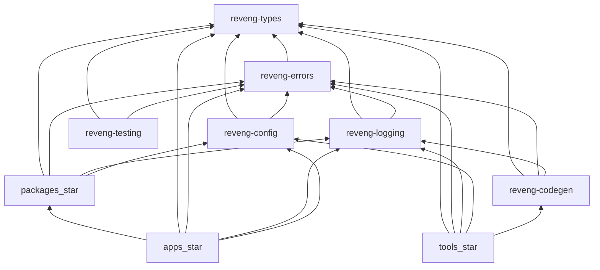

### 29.3 Build Pipeline

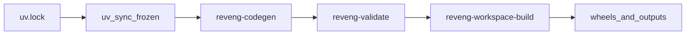

### 29.4 CI/CD Pipeline

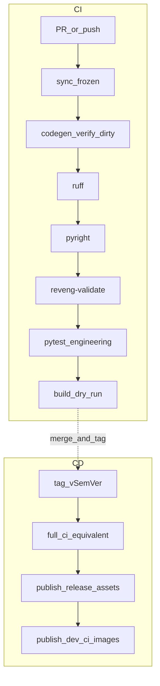

### 29.5 Git Workflow

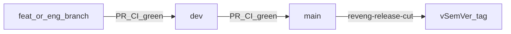

### 29.6 Developer Workflow

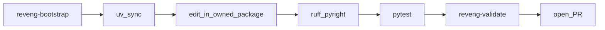

### 29.7 Bootstrap Flow

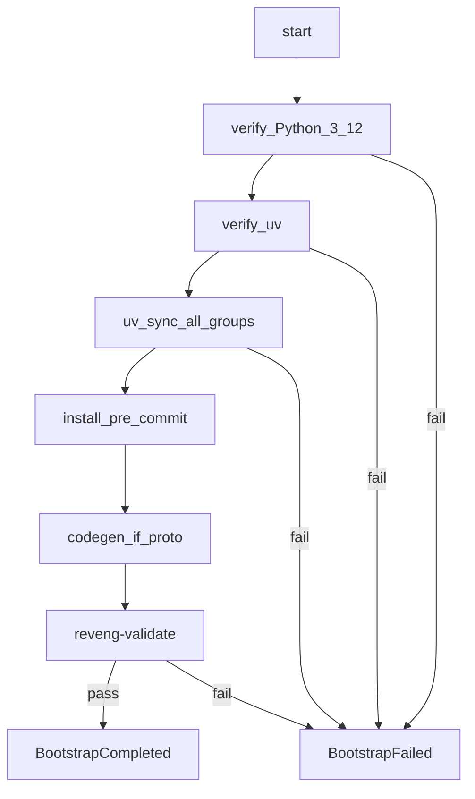

### 29.8 Configuration Hierarchy

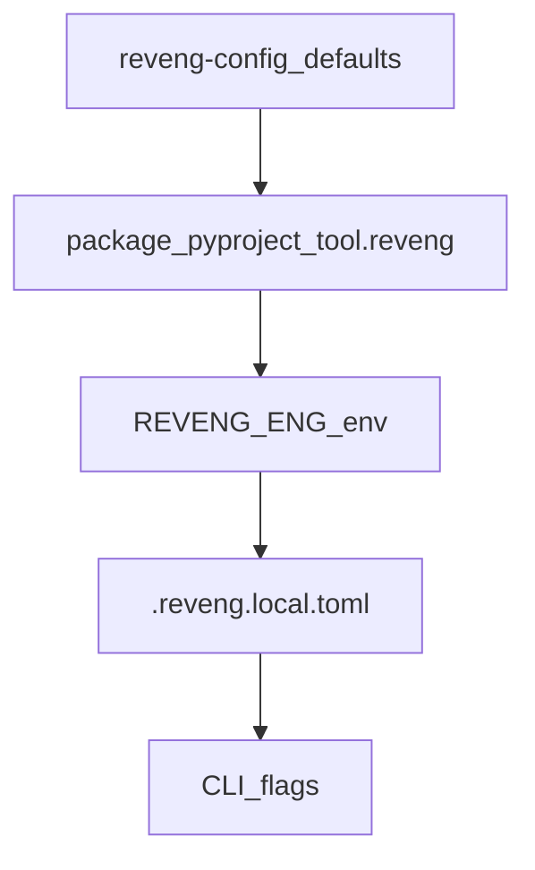

### 29.9 Shared Library Architecture

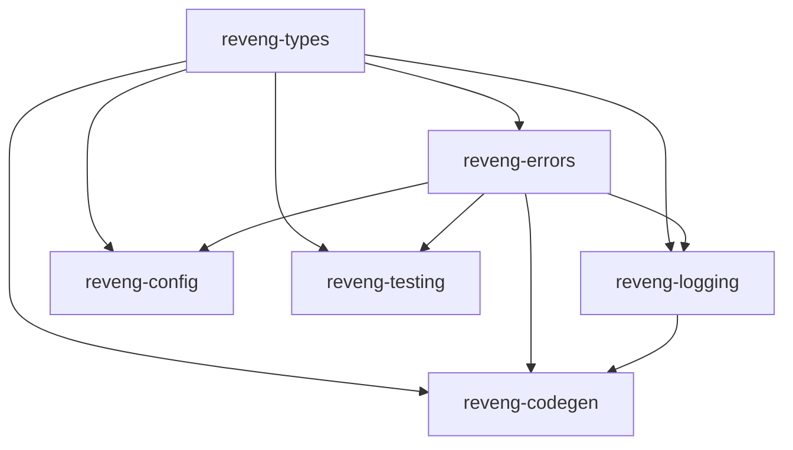

### 29.10 Test Architecture

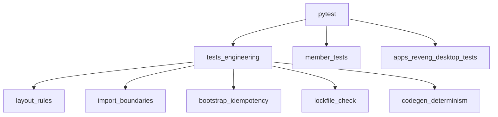

### 29.11 Documentation Architecture

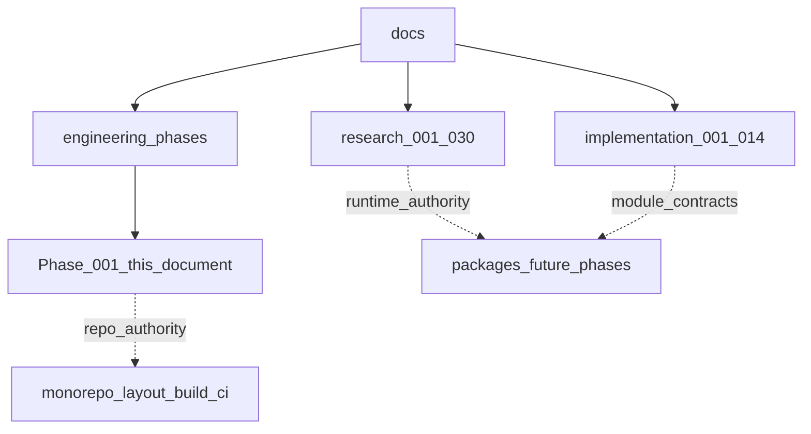

### 29.12 Overall Engineering Architecture

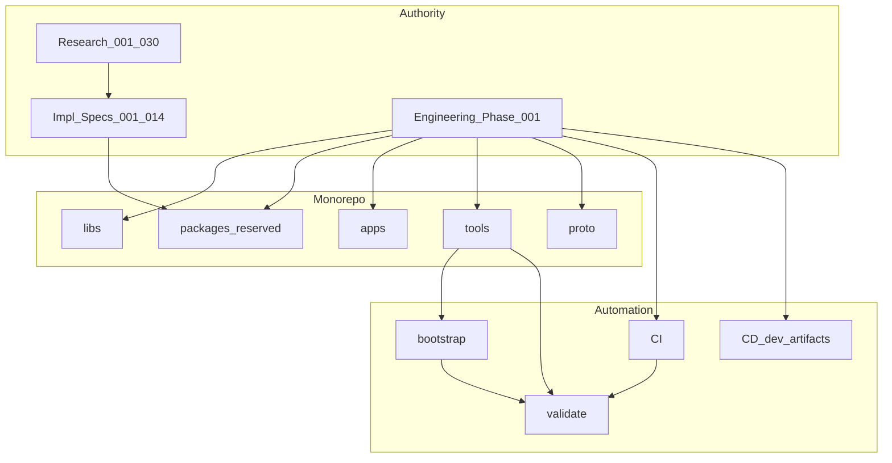

---

## Document Control

| Field | Value |
|---|---|
| Document ID | ENGINEERING_PHASE_001 |
| Title | Repository Foundation & Engineering Infrastructure |
| Normative | Yes |
| Supersedes | None |
| Superseded by | None |
| Related | Research 001–030; Implementation Specifications 001–014 |
